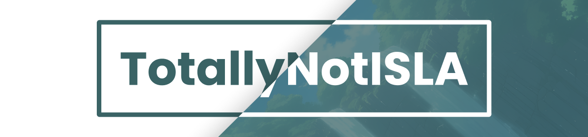

# Hi there! 👋 I'm ISLA.

Nice to meet you, i might have a bad skill. But, i'm still learning 😉.

## About Me

I am a Junior Developer passionate about building and exploring a world i've never seen before. My journey in the world of coding has been an exciting adventure, and I love the process of turning ideas into reality through code.

## My Specialities

  
  
  
  
  
  
  
  
  

## Connect with Me

-   Twitter: [@isla3859](https://twitter.com/isla3859)
-   Discord: [@totallynotisla](https://discord.com/users/678444178329305121)

## Top Languages

[]

## Featured Repositories

